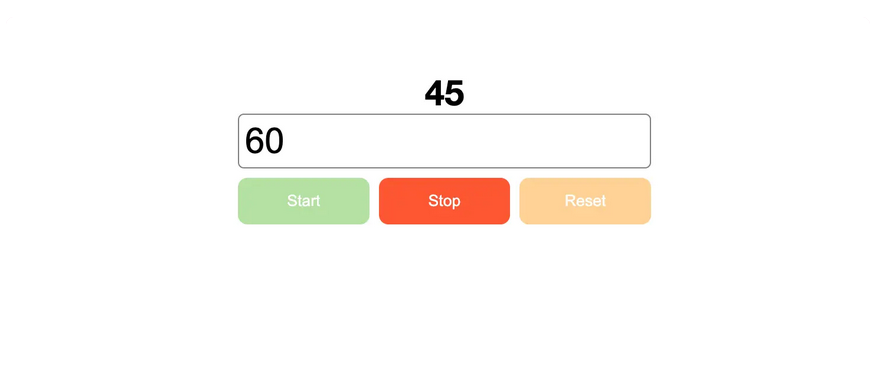

# Challenge_30DaysOf_JavaScript

## Day 23 - Timer

Our first short project, we shall make a countdown timer
We will give the user a text box to enter the time, a number showing the current time and some buttons to control the timer

Just like the image below

