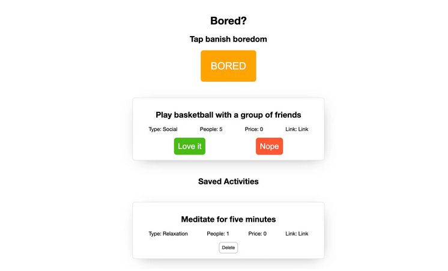

# Challenge_30DaysOf_JavaScript

## Day 24 & 25 - Banish Boredom Part 1 and 2

Our first full project we are going to consume an API
We are going to create an website called 'Banish Boredom' that uses [The Bored API](https://bored.api.lewagon.com/)* to help our users come up with things to do

Just like the image below

*I used a different API link since the one used in the website isn't available anymore, so a few things can be different, but the final result is the same!