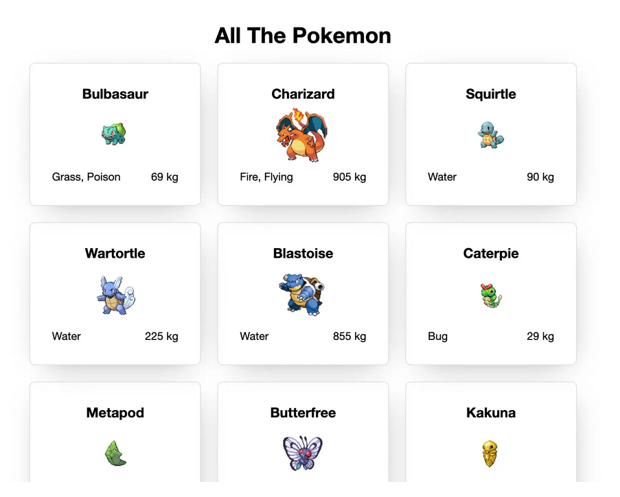
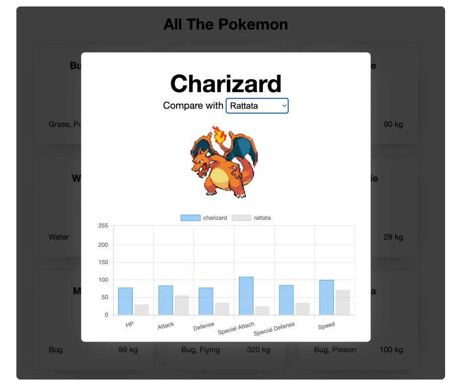

# Challenge_30DaysOf_JavaScript

## Day 26, 27 & 28 - Making a PokeDex

Our first full project we are going to consume an API
We are going to be creating a PokeDex by using the [PokeAPI](https://pokeapi.co/)

- Loads Pokemons from the PokeAPI in grups of 20
- Displays little cards for each Pokemon
- Displays a modal when a card is clicked
- Shows a graph of the pokemon's 6 status using [ChartJS](https://www.chartjs.org/)
- Compares 2 pokemon at the same time

Just like the image below

